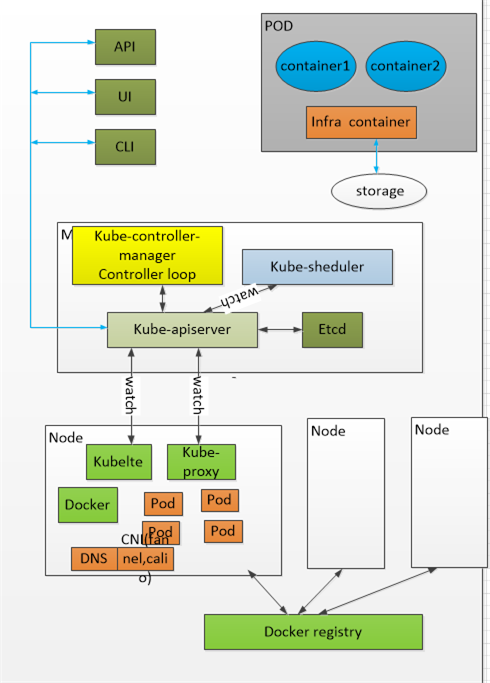

## **<font color=Red>基础概念**

```
- 非静态，动态服务发现 Cloud native computing foundation CNCF
- 容器服务编排系统
　　serveice discovery
    load balancing
    secret/configuration/storage management
    health checks
    auto-[scaling/resart/heakling] of containers and nodes
    zero-downtime deploys

K8s
docker swarm
apache mesos marathon

陈述式API
声明式API
master

Kube-controller-manager　Controller loop（无限循环，每隔1秒就检查容器是否满足用户的期望值）
  watch-------

container runtime interface -CRI
container network interface -CNI
container storage interface -CSI
```

## **<font color=Red>就集群部署以及陈述式命令管理**

```
K83 API : REST API(HTTP/HTTPS)
 　Resource --> object(对象)
 　method : get put post delete patch

资源类型： 　
　　基础对象：POD service namesapce volume
  　控制器对象，建立在基础镜像的，replicaseet deploymente daemonset statufull job

k8s：cluster 容器编排系统
　　核心任务：容器编排
　　容器：　应用程序
    Pod Controller ,Depleyment 控制器资源对象

    控制器：就是之前运维人员做的事情（职能），发布　创建，扩容　缩容的工作


```
## **<font color=Red>资源类型以及配置清单**




```
k8s入门：
  API Server：6443
  API Server-用户认证：双向认证

  默认情况 都在default这个名称空间
  kubectl api-resources --支持的资源类型

  查看资源：
  kubectl get ns /namesapce
  kubectl get nodes
  kubectl get pods -n kube-system
  kubectl get pods -n kube-system -o wide 长格式形式
  kubectl get ns/default -o yaml  --输出yaml格式
  kubectl get ns/default -o json   --输出json格式
  kubectl describe  ns/default

  创建资源：
  Create a resource from a file or from stdin
   kubectl create namespace develop
   kubectl create ns/develop

  删除资源
  kubectl delete ns/develop

  每一个资源都遵循下面的格式：
    apiVersion: v1  ----资源的版本
	kind: Namespace  -----资源类型
	metadata:   ---嵌套 资源名称和资源所属的名称空间，资源标签
	  creationTimestamp: "2019-09-15T04:10:01Z"
	  name: default
	  resourceVersion: "32"
	  selfLink: /api/v1/namespaces/default
	  uid: aff7ae9d-d76e-11e9-b91c-000c29486c30
	spec:  ---规范，用户希望的状态  --通过和解循环（recondiliation loop）
	  finalizers:
	  - kubernetes
	status:
	  phase: Active


  ---实例创建deployment
  kubectl create deployment ngx-dep --image=nginx:1.14-alpine


  [root@master pki]#kubectl create deployment ngx-dep --image=nginx:1.14-alpine^C
	[root@master pki]#kubectl get all
	NAME                           READY   STATUS    RESTARTS   AGE
	pod/ngx-dep-68699d7cc4-c7cnk   1/1     Running   0          19s

	NAME                 TYPE        CLUSTER-IP   EXTERNAL-IP   PORT(S)   AGE
	service/kubernetes   ClusterIP   10.96.0.1    <none>        443/TCP   171d

	NAME                      READY   UP-TO-DATE   AVAILABLE   AGE
	deployment.apps/ngx-dep   1/1     1            1           19s

	NAME                                 DESIRED   CURRENT   READY   AGE
	replicaset.apps/ngx-dep-68699d7cc4   1         1         1       19s


	[root@master pki]#kubectl get pod
	NAME                       READY   STATUS    RESTARTS   AGE
	ngx-dep-68699d7cc4-c7cnk   1/1     Running   0          50s
	[root@master pki]#kubectl get pod -o wide
	NAME                       READY   STATUS    RESTARTS   AGE   IP            NODE               NOMINATED NODE   READINESS GATES
	ngx-dep-68699d7cc4-c7cnk   1/1     Running   0          61s   10.244.2.30   node3.magedu.com   <none>           <none>
	[root@master pki]#


    ----删除后，控制立刻生成一个新的pod
   [root@master pki]#kubectl delete pods/ngx-dep-68699d7cc4-c7cnk
	pod "ngx-dep-68699d7cc4-c7cnk" deleted

	[root@master pki]#
	[root@master pki]#kubectl get pod ----删除后，控制立刻生成一个新的pod
	NAME                       READY   STATUS    RESTARTS   AGE
	ngx-dep-68699d7cc4-rlj6q   1/1     Running   0          15s
	[root@master pki]#


   创建deployment
   kubectl create deploy myapp --image=ikubernetes/myapp:v1
   创建service
   kubectl create service clusterip myapp --tcp=80:80


   pod 扩容：
   Deploy Commands:
	  rollout        Manage the rollout of a resource
	  scale          Set a new size for a Deployment, ReplicaSet, Replication Controller, or Job
	  autoscale      Auto-scale a Deployment, ReplicaSet, or ReplicationController


  [root@master ~]#kubectl scale --replicas=3 deployment msapp
	deployment.extensions/msapp scaled
	[root@master ~]#

   ---资源图 pod资源


API 版本：
    api接口的资源分为多个逻辑组合：
    每一个组合：api group ，api群组

  [root@master ~]#kubectl api-versions
	admissionregistration.k8s.io/v1beta1
	apiextensions.k8s.io/v1beta1
	apiregistration.k8s.io/v1
	apiregistration.k8s.io/v1beta1
	apps/v1
	apps/v1beta1
	apps/v1beta2
	authentication.k8s.io/v1
	authentication.k8s.io/v1beta1
	authorization.k8s.io/v1
	authorization.k8s.io/v1beta1
	autoscaling/v1
	autoscaling/v2beta1
	autoscaling/v2beta2
	batch/v1
	batch/v1beta1
	certificates.k8s.io/v1beta1
	coordination.k8s.io/v1beta1
	events.k8s.io/v1beta1
	extensions/v1beta1
	networking.k8s.io/v1
	policy/v1beta1
	rbac.authorization.k8s.io/v1
	rbac.authorization.k8s.io/v1beta1
	scheduling.k8s.io/v1beta1
	storage.k8s.io/v1
	storage.k8s.io/v1beta1
	v1


```
## **<font color=Red>POD资源和控制器**

```python
管理pod资源：
  api server 接受和返回的所有json格式对象都遵循同一模式 ，他们都具有
  ‘kind‘ 和 ’apiVersion‘字段 用于标识对象所属的资源类型 api群组以及相关的版本
  大多数的对象或列表类型的资源还需要具有三个嵌套型的字段 metadata spec status
  1 metadata 字段为资源提供元数据信息例如名称 隶属于的名称空间和标签导等
  2 spec用于定义用户期望的状态，不同的资源类型 其状态的意义各有不同，例如 Pod资源最为核心的功能在于运行容器
  3 staus 则记录着活动对象的当前状态信息，它有kubernetes系统自行维护，对用户来说只读字段
  kubectl api-versions 命令获取集群支持使用的所有资源类型

  查看资源的信息：
  https://kubernetes.io/docs/reference/generated/kubernetes-api/v1.17/

  资源对象管理方式：
     陈述式命令，run
     陈述式对象命令格式 -json格式 create kubectl create -f nd.yaml
     声明式对象配置   -json格式 apply kubectl apply -f nd.yaml

查看资源配置文档：
		kubectl explain pods
		KIND:     Pod
		VERSION:  v1

		DESCRIPTION:
			 Pod is a collection of containers that can run on a host. This resource is
			 created by clients and scheduled onto hosts.

		FIELDS:
		   apiVersion   <string>
			 APIVersion defines the versioned schema of this representation of an
			 object. Servers should convert recognized schemas to the latest internal
			 value, and may reject unrecognized values. More info:
			 https://git.k8s.io/community/contributors/devel/api-conventions.md#resources

		   kind <string>
			 Kind is a string value representing the REST resource this object
			 represents. Servers may infer this from the endpoint the client submits
			 requests to. Cannot be updated. In CamelCase. More info:
			 https://git.k8s.io/community/contributors/devel/api-conventions.md#types-kinds

		   metadata     <Object>    --- object是对象，可以进一步去查询kubectl explain pods.metadata
			 Standard object's metadata. More info:
			 https://git.k8s.io/community/contributors/devel/api-conventions.md#metadata

		   spec <Object>
			 Specification of the desired behavior of the pod. More info:
			 https://git.k8s.io/community/contributors/devel/api-conventions.md#spec-and-status

		   status       <Object>
			 Most recently observed status of the pod. This data may not be up to date.
			 Populated by the system. Read-only. More info:
			 https://git.k8s.io/community/contributors/devel/api-conventions.md#spec-and-status

		[root@master bas


apiVersion : v1
kind: Pod
metadata:
		  name: pod-demo
		  namespace: develop
		spec:
		  containers:
		  - image: ikubernetes/myapp:v1
			name: myapp
		  - image: busybox:latest
			name: bbox
			imagePullPolicy: IfNotPresent
			command:
			- /bin/sh
			- -c
			- 'sleep 86400'
-------查看ｐｏｄ信息
	   apiVersion: v1
		items:
		- apiVersion: v1
		  kind: Pod
		  metadata:
			annotations:
			  kubectl.kubernetes.io/last-applied-configuration: |
				{"apiVersion":"v1","kind":"Pod","metadata":{"annotations":{},"name":"pod-demo","namespace":"develop"},"spec":{"containers":[{"image":"ikubernetes/myapp:v1","name":"myapp"},{"command":["/bin/sh","-c","sleep 86400"],"image":"busybox:latest","imagePullPolicy":"IfNotPresent","name":"bbox"}]}}
			creationTimestamp: "2020-03-05T06:38:09Z"
			name: pod-demo
			namespace: develop
			resourceVersion: "211508"
			selfLink: /api/v1/namespaces/develop/pods/pod-demo
			uid: e0c26e50-5eab-11ea-b889-000c29486c30
		  spec:
			containers:
			- image: ikubernetes/myapp:v1
			  imagePullPolicy: IfNotPresent
			  name: myapp
			  resources: {}
			  terminationMessagePath: /dev/termination-log
			  terminationMessagePolicy: File
			  volumeMounts:
			  - mountPath: /var/run/secrets/kubernetes.io/serviceaccount
				name: default-token-ttqlh
				readOnly: true
			- command:
			  - /bin/sh
			  - -c
			  - sleep 86400
			  image: busybox:latest
			  imagePullPolicy: IfNotPresent
			  name: bbox
			  resources: {}
			  terminationMessagePath: /dev/termination-log
			  terminationMessagePolicy: File
			  volumeMounts:
			  - mountPath: /var/run/secrets/kubernetes.io/serviceaccount
				name: default-token-ttqlh
				readOnly: true
			dnsPolicy: ClusterFirst
			enableServiceLinks: true
			nodeName: node1.magedu.com
			priority: 0
			restartPolicy: Always
			schedulerName: default-scheduler
			securityContext: {}
			serviceAccount: default
			serviceAccountName: default
			terminationGracePeriodSeconds: 30
			tolerations:
			- effect: NoExecute
			  key: node.kubernetes.io/not-ready
			  operator: Exists
			  tolerationSeconds: 300
			- effect: NoExecute
			  key: node.kubernetes.io/unreachable
			  operator: Exists
			  tolerationSeconds: 300
			volumes:
			- name: default-token-ttqlh
			  secret:
				defaultMode: 420
				secretName: default-token-ttqlh
		  status:
			conditions:
			- lastProbeTime: null
			  lastTransitionTime: "2020-03-05T06:38:09Z"
			  status: "True"
			  type: Initialized
			- lastProbeTime: null
			  lastTransitionTime: "2020-03-05T06:38:11Z"
			  status: "True"
			  type: Ready
			- lastProbeTime: null
			  lastTransitionTime: "2020-03-05T06:38:11Z"
			  status: "True"
			  type: ContainersReady
			- lastProbeTime: null
			  lastTransitionTime: "2020-03-05T06:38:09Z"
			  status: "True"
			  type: PodScheduled
			containerStatuses:
			- containerID: docker://d877740aad9ca61c3e8153065effa7ff3e9320a876e38ce5885cc1a793a2d16c
			  image: busybox:latest
			  imageID: docker-pullable://busybox@sha256:fe301db49df08c384001ed752dff6d52b4305a73a7f608f21528048e8a08b51e
			  lastState: {}
			  name: bbox
			  ready: true
			  restartCount: 0
			  state:
				running:
				  startedAt: "2020-03-05T06:38:10Z"
			- containerID: docker://04b30f397edc656ec3c8890ef81a695de41c9115e87dce8b6e6bf8f5782f91c9
			  image: ikubernetes/myapp:v1
			  imageID: docker-pullable://ikubernetes/myapp@sha256:9c3dc30b5219788b2b8a4b065f548b922a34479577befb54b03330999d30d513
			  lastState: {}
			  name: myapp
			  ready: true
			  restartCount: 0
			  state:
				running:
				  startedAt: "2020-03-05T06:38:10Z"
			hostIP: 192.168.10.4
			phase: Running
			podIP: 10.244.1.46
			qosClass: BestEffort
			startTime: "2020-03-05T06:38:09Z"
		kind: List
		metadata:
		  resourceVersion: ""
		  selfLink: ""

进入pod容器
  kubectl exec pod-demo -c bbox -n develop -it  -- /bin/sh （两个容器共享一个名称空间）
    获取容器日志：
    [root@master base]kubectl logs pod-demo -n develop -c myap[如果pod有多个容器，需要-c 加容器名称，看具体的容器log]
    127.0.0.1 - - [05/Mar/2020:06:43:27 +0000] "GET / HTTP/1.1" 200 65 "-" "Wget" "-"

共享主机网络：
		 hostNetwork: true
		 apiVersion : v1
			kind: Pod
			metadata:
			  name: mypod
			  namespace: default
			spec:
			  containers:
			  - image: ikubernetes/myapp:v1
				name: myapp
			  hostNetwork: true

port 配置：

    apiVersion : v1
		kind: Pod
		metadata:
		  name: mypod
		  namespace: default
		spec:
		  containers:
		  - image: ikubernetes/myapp:v1
			name: myapp
			ports:
			- protocol: TCP
			  containerPort: 80
			  name: http
			  hostPort: 8080

pord ip 10.244.0.0/16
     能否被集群外的客户端访问“
	    service :Nodeport 每一个节点都会打开一个port对应
		hostport：    只有一个节点能访问
		hostnetwrok： 只有一个节点能访问
	能否被网络内部的pod访问;
	    能否被网络内部的pod访问
Pods---> object
      控制器：
          ReplicaSet -->object(ngx-rs.....)
             control loop和解循环
      	   replicaset daemon 每一个控制必须有一个controller 的守护进程 kube-controller-manager
      	   replication controller
      	   doployment controller
      	   daemon controller
      	   statuful controller
      	   job controller
      	   cronjob controller


早起的版本：replication controller
      新版本被划分为多种类型：
        1 守护进程
            - 无状态：
      	       非系统级：deployment controller  | replicatSet controller
      		   　系统级：daemonSet controller （每一个节点只能有一个）
      	  - 有状态： statefulSet deployment
        2 非守护进程型
            - job
      	  - cronJob 周期性的job

      ReplicaSet：

ReplicaSet controller：确保在任何时间都要运行足够的pod副本
      　- Pod template
      	- pod selector
      	- replicas

      apiVersion: apps/v1
      	kind: ReplicaSet
      	metadata:
      	  name: myapp-rs
      	spec:
      	  replicas: 6
      	  selector:
      		 matchLabels:
      		   app: myapp-pod
      	  template:
      		metadata:
      		  labels:
      			app: myapp-pod
      		spec:
      		  containers:
      		  - name: myapp
      			image: ikubernetes/myapp:v1 改为ikubernetes/myapp:v2
      			ports:
      			- name: http
      			  containerPort: 80


      Deployment：

      	kubectl get pod -n prod -w  --监控pod的变化
      	deployment：
      		apiVersion: apps/v1
      		kind: Deployment
      		metadata:
      		  name: myapp
      		  namespace: prod
      		spec:
      		  replicas: 3
      		#  minReadySeconds: 10
      		#  strategy:
      		#    rollingUpdate: 先加后减
      		#      maxSurge: 1 多加多少
      		#     maxUnavailable: 1 减少多少
      		#   type: RollingUpdate
      		  selector:
      			matchLabels:
      			  app: myapp
      			  rel: stable
      		  template:
      			metadata:
      			  labels:
      				app: myapp
      				rel: stable
      			spec:
      			  containers:
      			  - name: myapp
      				image: ikubernetes/myapp:v1
      				ports:
      				- containerPort: 80
      				  name: http
      				readinessProbe:
      				  periodSeconds: 1
      				  httpGet:
      					path: /
      					port: http
      	1 : 修改ikubernetes/myapp:v2  自动更新
      	2：增加滚动策略，但是这个时候 不会更新，改变的是controller的本身，pod本身不会自动更新
      	kubectl apply -f deploy-nginx.yaml --record -n prod （record 记录版本滚动升级的历史）
      	[root@master chapter5]#kubectl explain deployment.spec.strategy.rollingUpdate:定义
      		apiVersion: apps/v1
      		kind: Deployment
      		metadata:
      		  name: myapp
      		  namespace: prod
      		spec:
      		  replicas: 3
      		  minReadySeconds: 10
      		  strategy:
      			rollingUpdate: 先加后减
      			  maxSurge: 1 多加多少
      			  maxUnavailable: 1 减少多少
      		   type: RollingUpdate
      		  selector:
      			matchLabels:
      			  app: myapp
      			  rel: stable
      		  template:
      			metadata:
      			  labels:
      				app: myapp
      				rel: stable
      			spec:
      			  containers:
      			  - name: myapp
      				image: ikubernetes/myapp:v1
      				ports:
      				- containerPort: 80
      				  name: http
      				readinessProbe:
      				  periodSeconds: 1
      				  httpGet:
      					path: /
      					port: http


      	3 通过设置 image 版本来更新pod
      	kubectl set image -h
      	kubectl set image deployment myapp myapp=ikuernetes/myapp:v2 -- record -n prod

      	4 查看历史版本的信息
      	kubectl  rollout -h
      		[kubectl  rollout history deployment/nginx -n prod     查看历史
      		deployment.extensions/nginx
      		REVISION  CHANGE-CAUSE
      		1         <none>
      		2         kubectl apply --filename=deploy-nginx.yaml --record=true --namespace=prod
      		3         kubectl apply --filename=deploy-nginx.yaml --record=true --namespace=prod
      		4         kubectl apply --filename=deploy-nginx.yaml --record=true --namespace=prod.


      	5 回滚操作：
      	kubectl  rollout undo deployment/nginx -n prod

      daemonSet：NODE只运行一个pod
       - selector
       - template
      runing pods on only some nodes
       - spec.template.spec.nodeSelector
       - .spec.template.spec.affinity

      apiVersion: apps/v1
      kind: DaemonSet
      metadata:
        name: filebeat-ds
        namespace: prod
        labels:
          app: filebeat
      spec:
        selector:
          matchLabels:
            app: filebeat
        template:
          metadata:
            labels:
              app: filebeat
            name: filebeat
          spec:
            containers:
            - name: filebeat
              image: ikubernetes/filebeat:5.6.5-alpine
              env:
              - name: REDIS_HOST
                value: db.ikubernetes.io:6379
              - name: LOG_LEVEL
                value: info

      [root@master chapter5]#kubectl get pods -n prod --show-labels
      NAME                     READY   STATUS    RESTARTS   AGE   LABELS
      filebeat-ds-89q6p        1/1     Running   0          42s   app=filebeat,controller-revision-hash=b48585f6f,pod-template-generation=1
      filebeat-ds-8fbsj        1/1     Running   0          42s   app=filebeat,controller-revision-hash=b48585f6f,pod-template-generation=1
      filebeat-ds-hbnvz        1/1     Running   0          42s   app=filebeat,controller-revision-hash=b48585f6f,pod-template-generation=1
      myapp-7bc949d557-bmm5r   1/1     Running   0          57m   app=myapp,pod-template-hash=7bc949d557,rel=stable
      myapp-7bc949d557-gj8xj   1/1     Running   0          57m   app=myapp,pod-template-hash=7bc949d557,rel=stable
      myapp-7bc949d557-nks2c   1/1     Running   0          57m   app=myapp,pod-template-hash=7bc949d557,rel=stable
      [root@master chapter5]#kubectl get pods -n prod -l app=filebeat -o wide
      NAME                READY   STATUS    RESTARTS   AGE   IP            NODE               NOMINATED NODE   READINESS GATES
      filebeat-ds-89q6p   1/1     Running   0          63s   10.244.1.64   node1.magedu.com   <none>           <none>
      filebeat-ds-8fbsj   1/1     Running   0          63s   10.244.4.54   node2.magedu.com   <none>           <none>
      filebeat-ds-hbnvz   1/1     Running   0          63s   10.244.2.59   node3.magedu.com   <none>           <none>
      [root@master chapter5]#
查看节点信息:
    ubectl describe node master.magedu.com
      Name:               master.magedu.com
      Roles:              master
      Labels:             beta.kubernetes.io/arch=amd64
                          beta.kubernetes.io/os=linux
                          kubernetes.io/hostname=master.magedu.com
                          node-role.kubernetes.io/master=
      Annotations:        flannel.alpha.coreos.com/backend-data: {"VtepMAC":"06:2e:49:a9:06:14"}
                          flannel.alpha.coreos.com/backend-type: vxlan
                          flannel.alpha.coreos.com/kube-subnet-manager: true
                          flannel.alpha.coreos.com/public-ip: 192.168.10.3
                          kubeadm.alpha.kubernetes.io/cri-socket: /var/run/dockershim.sock
                          node.alpha.kubernetes.io/ttl: 0
                          volumes.kubernetes.io/controller-managed-attach-detach: true
      CreationTimestamp:  Sun, 15 Sep 2019 12:10:00 +0800
      Taints:             node-role.kubernetes.io/master:NoSchedule ----污点
      Unschedulable:      false

      更新：
       kubectl set image ds/filebeat-ds filebeat=ikubernetes/filebeat:5.6.6-alpine -n prod


      选择node：
      kubectl label nodes node3.magedu.com logcollecting=on

      [root@master chapter5]#vim filebeat-ds.yaml
      apiVersion: apps/v1
      kind: DaemonSet
      metadata:
        name: filebeat-ds
        namespace: prod
        labels:
          app: filebeat
      spec:
        selector:
          matchLabels:
            app: filebeat
        template:
          metadata:
            labels:
              app: filebeat
            name: filebeat
          spec:
            containers:
            - name: filebeat
              image: ikubernetes/filebeat:5.6.5-alpine
              env:
              - name: REDIS_HOST
                value: db.ikubernetes.io:6379
              - name: LOG_LEVEL
                value: info
            nodeSelector:
              logcollecting: 'on'


job 创建一次性工作
       - selector
       - template
       - parallel jobs:
         - non-parallel jobs --串行
         - parallel jobs with fixed completion count .spec.completions --完成率
         - parallel jobs with a work queue : .spec.parallelism --并行率

       一次性job 可以串行或者并行：


garbage collection：


```
## **<font color=Red>service资源**

```
```
## **<font color=Red>存储卷**

```
```
## **<font color=Red>configmap and secret**

```

```
## **<font color=Red>statefull控制**

```
```


## **<font color=Red>认证授权和准入控制**

```

```


## **<font color=Red>网络模型　以及网络策略**

## **<font color=Red>POD资k源调度**

## **<font color=Red>CRD自定义资源　　自定义控制器**

## **<font color=Red>资源指标HPA控制器**

## **<font color=Red>HELM管理器**

## **<font color=Red>高可靠Kebernetes**
