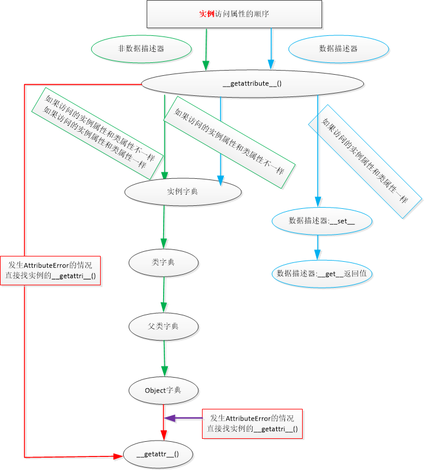

# **描述器**

- 方法签名如下
  - object.__get__(self, instance, owner)
  - object.__set__(self, instance, value)
  - object.__delete__(self, instance)
    - self 指代当前实例,调用者
    - instance 是owner的实例
    - owner 是属性的所属的类
- 请思考下面程序的执行流程是什么?




```python


class A:#描述器
    def __init__(self):
        self.a1 = 'a1'
        print('A.init')

    def __get__(self, instance, owner):
        print("get~~~~",self, instance, owner)
        print(self.__dict__)
        return  self

class B: #属主类
    x = A()
    def __init__(self):
        print('B.init')


print('-'*20)
print(B.x)
print(B.x.a1)
print('='*20)
b = B()
print(b.x)
print(b.x.a1)
---------------------------------
A.init
--------------------
get~~~~ <__main__.A object at 0x0000018F054BE948> None <class '__main__.B'>
{'a1': 'a1'}
<__main__.A object at 0x0000018F054BE948>
get~~~~ <__main__.A object at 0x0000018F054BE948> None <class '__main__.B'>
{'a1': 'a1'}
a1
====================
B.init
get~~~~ <__main__.A object at 0x0000018F054BE948> <__main__.B object at 0x0000018F054BEA08> <class '__main__.B'>
{'a1': 'a1'}
<__main__.A object at 0x0000018F054BE948>
get~~~~ <__main__.A object at 0x0000018F054BE948> <__main__.B object at 0x0000018F054BEA08> <class '__main__.B'>
{'a1': 'a1'}
a1

Process finished with exit code 0

'''
因为定义了 __get__ 方法,类A就是一个描述器,对类B或者类B的实例的x属性(B类的属性)读取,成为对类A的实例的访问,就会调用 __get__ 方法
如何解决上例中访问报错的问题,问题应该来自 __get__ 方法。
self, instance, owner这三个参数,是什么意思?来看输出结

self 对应都是A的实例
owner 对应都是B类
instance 说明
- None表示不是B类的实例,对应调用B.x
- <__main__.B object at 0x0000000000B84F28>表示是B的实例,对应调用B().x
使用返回值解决。返回self,就是A的实例,该实例有a1属性,返回正常
'''
```

##  **<font color=Red> 描述器只能用于类属性，跟属主的类属性有关**
```python


class A:#描述器
    def __init__(self):
        self.a1 = 'a1'
        print('A.init')

    def __get__(self, instance, owner):
        print("get~~~~",self, instance, owner)
        print(self.__dict__)
        return  self

class B: #属主类
    x = A() # 描述器只能用于类属性，跟属主的类属性有关
    def __init__(self):
        self.x = A() #实例属性不会按照描述器执行
        print('B.init')


print('-'*20)
print(B.x)
print(B.x.a1)
print('='*20)
b = B()
print(b.x) #实例跟描述器没有关系　不会调用Ａ的__get__方法
print(b.__dict__)
print(B.__dict__)

'''
D:\python_code\venv\Scripts\python.exe D:/test/attribute/class_describer.py
A.init
--------------------
get~~~~ <__main__.A object at 0x000002B240C4EA08> None <class '__main__.B'>
{'a1': 'a1'}
<__main__.A object at 0x000002B240C4EA08>
get~~~~ <__main__.A object at 0x000002B240C4EA08> None <class '__main__.B'>
{'a1': 'a1'}
a1
====================
A.init
B.init
{'x': <__main__.A object at 0x000002B240C4EB48>}
{'__module__': '__main__', 'x': <__main__.A object at 0x000002B240C4EA08>, '__init__': <function B.__init__ at 0x000002B240C44E58>, '__dict__': <attribute '__dict__' of 'B' objects>, '__weakref__': <attribute '__weakref__' of 'B' objects>, '__doc__': None}

Process finished with exit code 0
'''
```

## **<font color=Red>描述器定义**
- Python中,一个类实现了 __get__ 、 __set__ 、 __delete__ 三个方法中的任何一个方法,就是描述器。实现这三个中的某些方法,就支持了描述器协议。
- 仅实现了 __get__ [______get____],就是**非数据描述符** __non-data descriptor__
- 实现了 __get__  [______get____]、 __set__ [______set____] **就是数据描述符** __data descriptor__
- 如果一个类的类属性设置为描述器实例,那么它被称为owner属主。当该类的该类属性被查找、设置、删除时,就会调用描述器相应的方法。


## **描述器应用**

```python
from _functools import partial,wraps,update_wrapper


class StaticMethod:

    def __init__(self,fn):
        self.fn = fn

    def __get__(self, instance, owner):
        print(self,instance,owner)
        return self.fn


class ClassMethod:

    def __init__(self,fn):
        self.fn = fn

    def __get__(self, instance, owner):
        print(self,instance,owner)
        newfunction = partial(self.fn, owner)
        return newfunction

class A:

    @StaticMethod
    def smtd(x,y):#smtd = StaticMethod(smtd)
        """ smtd """
        print("staitc method ++++++++++++++++")

    @ClassMethod
    def foo(cls,x,y):#foo = classmethod(foo):
        """ cls +++++++++++++++++"""
        print("class method ++++++++++++++++",cls.__name__,x,y)

A.foo(10,15)
#
# a.smtd(4,5)
# print(a.smtd.__name__)
```

## **类属性检查**
```python
import inspect

class TypeCheck:

    def __init__(self,name,typ):
        self.typ = typ
        self.name = name

    def __get__(self, instance, owner):
        print("get ~~~~~~~~~~~~~~~~~~~")
        if instance:
            return instance.__dict__[self.name]
        else:
            raise Exception

    def __set_name__(self, owner, name):
        print("setname =============================================")
        self.name = name

    def __set__(self, instance, value):
        print("set----------",self,instance,value)
        if instance:
            if isinstance(value,self.typ):
                instance.__dict__[self.name]=value
            else:
                raise TypeError(self.name)
        return

'''
装饰器：函数的装饰器，
'''
def datainject(cls):
    sig = inspect.signature(cls)
    params = sig.parameters
    for name,param in params.items():
        print(name,param.name,param.kind,param.default,param.annotation)
        if param.annotation != param.empty:#inspect._empty:
            setattr(cls, name, TypeCheck(name,param.annotation))
    return cls

'''
装饰器：类的装饰器
'''
class DataInject:
    def __init__(self,cls):
        self.cls = cls
        sig = inspect.signature(self.cls)
        params = sig.parameters
        for name, param in params.items():
            print(name, param.name, param.kind, param.default, param.annotation)
            if param.annotation != param.empty:  # inspect._empty:
                setattr(self.cls, name, TypeCheck(name, param.annotation))

    def __call__(self, *args, **kwargs):
        return self.cls(*args,**kwargs)

@DataInject
class Persion:#Persion=DataInject(Persion)
    # name = TypeCheck(str) # 硬编码
    # age =  TypeCheck(int) # 硬编码

    def __init__(self, name:str, age:int):
       self.name = name
       self.age = age


print(Persion.__dict__)
t = Persion("tom",20)#DataInject(Persion)() ===> old Persion Instance
f = Persion("jerry",18)
print(t.__dict__)
print(t.name)
print(f.name)
#


```
