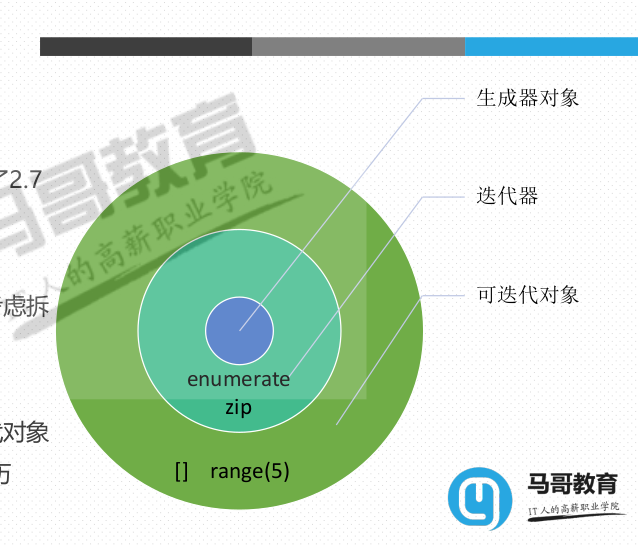

## **封装**


```

- 封装(装箱)
  -  将多个值使用逗号分割,组合在一起
   - 本质上,返回一个元组,只是省掉了小括号
t1 = (1,2) # 定义为元组
t2 = 1,2 # 将1和2封装成元组
type(t1)
type(t2)
```
(decoratordecoratordecorator

## **解构**

```python
a,*b,c = range(10)

a,*,c = range(10)
```
# **<font color=Red> Dict**

- key-value键值对的数据的集合
-  <font color=Red>**可变的 、 无序的 、 key不重复 </font>

## **dic的key要求必须可以hash**
- 目前学过的不可hash的类型有list、set,dict
- 元素不可以使用索引

## **dict定义 初始化**
- d = dict() 或者 d = {}
- dict(**kwargs) 使用name=value对初始化一个字典
- dict(iterable, **kwarg) 使用可迭代对象和name=value对构造字典,不过可迭代对象的元素必须是
一个二元结构
  - d = dict(((1,'a'),(2,'b'))) 或者 d = dict(([1,'a'],[2,'b']))
- dict(mapping, **kwarg) 使用一个字典构建另一个字典
  - d = {'a':10, 'b':20, 'c':None, 'd':[1,2,3]}
- 类方法dict.fromkeys(iterable, value)
- d = dict.fromkeys(range(5))
- d = dict.fromkeys(range(5),0)
-

dict.fromkeys(range(5),"b")　
{0: 'b', 1: 'b', 2: 'b', 3: 'b', 4: 'b'}


## **<font color=Red>字典的key**
- key的要求和set的元素要求一致
- set的元素可以就是看做key,set可以看做dict的简化版
- hashable 可哈希才可以作为key,可以使用hash()测试
- d = {1 : 0, 2.0 : 3, "abc" : None, ('hello', 'world', 'python') : "string", b'abc' : '135'}


## **<font color=Red>Python解析式、生成器**


### **<font color=Red>Pytho列表解析List Comprehension**
- 语法
  - [返回值 for 元素 in 可迭代对象 if 条件]
  - 使用中括号[],内部是for循环,if条件语句可选
  - 返回一个新的列表
  -
- 有这样的赋值语句newlist = [print(i) for i in range(10)],请问newlist的元素打印出来是什么?
   结果：要求<font color=Red>返回值
   　　　[None, None, None, None, None, None, None, None, None, None]

```python
even = []

for x in range(10):
  if x % 2 == 0:
    even.append(x)

even = [x for x in range(10) if x%2==0]

有这样的赋值语句newlist = [print(i) for i in range(10)],请问newlist的元素打印出来是什么?
   结果：要求<font color=Red>返回值
   　　　[None, None, None, None, None, None, None, None, None, None]


[expr for item in iterable if cond1 if cond2]

ret = []
for item in iterable:
  if cond1:
    if cond2:
      ret.append(expr)

# 字典删除
keys = []
for k,_ in d5.items():
    keys.append(k)
for i in keys:
    d5.pop(i)

```

### **<font color=Red>生成器表达式Generator expression**
- 语法
  - (返回值 for 元素 in 可迭代对象 if 条件)
  - 列表解析式的中括号换成小括号就行了
  - 返回一个生成器
- 和列表解析式的区别
 - 生成器表达式是按需计算(或称惰性求值、延迟计算),需要的时候才计算值
 - 列表解析式是立即返回值
- **<font color=Red>生成器**
 - 可迭代对象
 - 迭代器

- **<font color=Red>生成器表达式**

```python
g = ("{:04}".format(i) for i in range(1,11))
next(g)
for x in g:
  print(x)
print('~~~~~~~~~~~~')
for x in g:
  print(x)


g = ["{:04}".format(i) for i in range(1,11)]
for x in g:
  print(x)
print('~~~~~~~~~~~~')
for x in g:
  print(x)

'''
-总结
   延迟计算
  返回迭代器,可以迭代
  从前到后走完一遍后,不能回头

- 总结
  - 立即计算
  - 返回的不是迭代器,返回可迭代对象列表
  - 从前到后走完一遍后,可以重新回头迭代


'''
```
- 和列表解析式的对比
- 计算方式
     - **<font color=Red>生成器表达式延迟计算**,列表解析式立即计算
- 内存占用:**<font color=Red>不需要立即占用大量内存 和 cpu时间**</frot>
   - 从返回值本身来说,生成器表达式省内存,列表解析式返回新的列表
   - 生成器没有数据,内存占用极少,它是使用时一个个返回数据。如果将这些返回的数据合
起来占用的内存也和列表解析式差不多。但是,它不需要立即占用这么多内存
   - 列表解析式构造新的列表需要立即占用内存,不管你是否立即使用这么多数据
- 计算速度
  - 单看计算时间看,生成器表达式耗时非常短,列表解析式耗时长
  - 但是生成器本身并没有返回任何值,只返回了一个生成器对象
  - 列表解析式构造并返回了一个新的列表,所以看起来耗时了


### **<font color=Red>Pytho集合解析List Comprehension**

##### 语法
- {返回值 for 元素 in 可迭代对象 if 条件}
- 列表解析式的中括号换成大括号{}就行了
- 立即返回一个集合

### **<font color=Red>Pytho字典解析List Comprehension**

### 语法

- {返回值 for 元素 in 可迭代对象 if 条件}
- 列表解析式的中括号换成大括号{}就行了
- 使用key:value形式
- 立即返回一个字典

{str(x):y for x in range(3) for y in range(4)}

ret = {}
  for x in range(3):
    for y in range(4):
      ret[str(x)] = y

```
  {x:(x,x+1) for x in range(10)}
  {x:[x,x+1] for x in range(10)}
  {(x,):[x,x+1] for x in range(10)}
  {[x]:[x,x+1] for x in range(10)} #
  {chr(0x41+x):x**2 for x in range(10)}
 {str(x):y for x in range(3) for y in range(4)} # 输出多少个元素?
   {'0': 3, '1': 3, '2': 3} key一样　去重复
```

## **<font color=Red>可迭代对象，迭代器，生成器**

-  **<font color=Red>可迭代对象**
   - 能够用for in循环
- **<font color=Red>迭代器**
   - 能够用next函数的　惰行求值
- **<font color=Red>生成器代对象**
   -




## **datatime**
```
日期格式化*
 类方法 strptime(date_string, format) ,返回datetime对象 parse
 对象方法 strftime(format) ,返回字符串
 字符串format函数格式化
import datetime
dt = datetime.datetime.strptime("21/11/06 16:30", "%d/%m/%y %H:%M")
print(dt.strftime("%Y-%m-%d %H:%M:%S"))
print("{0:%Y}/{0:%m}/{0:%d} {0:%H}::{0:%M}::{0:%S}".format(dt))
print('{:%Y-%m-%d %H:%M:%S}'.format(dt))
```
