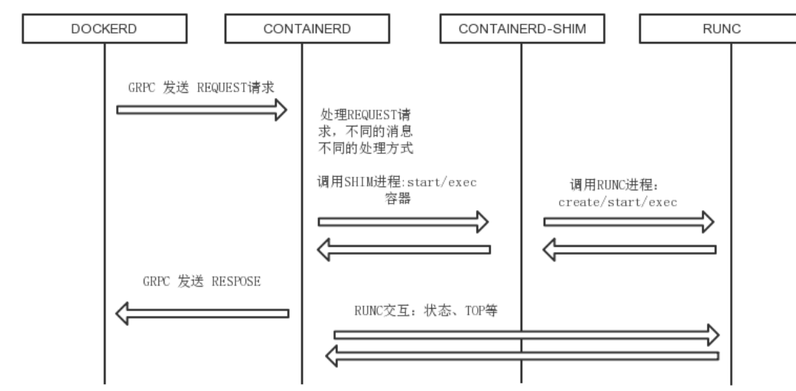

# **<font color=Red> Docker**


- 梳理linux kernel 的namespace和cgoups
- 梳理docker进程和容器的进程的关系
- 熟悉docker的操作命令

| 隔离类型        |    功能  |　系统调用参数|内核版本|
| :------------ |:---------------:|:------------ |:---------------:|
| MNT Namespace(mount)    |提供磁盘挂载点和文件系统的隔离能力 |CLONE_NEWNS|Linux 2.4.19|
|IPC Namespace(Inter-Process Communication) | 提供进程间通信的隔离能力      |CLONE_NEWIPC　| Linux 2.6.19|
|UTS Namespace(UNIX Timesharing System)| 提供主机名隔离能力    |CLONE_NEWUTS|Linux 2.6.19|
|PID Namespace(Process Identification)| 提供进程隔离能力|CLONE_NEWPID| Linux 2.6.29|
|Net Namespace(network)| 提供网络隔离能力 |CLONE_NEWNET|Linux 2.6.29|
|User Namespace(user)| 提供用户隔离能力 |CLONE_NEWUSER|Linux 3.8|


## **<font color=Red>MNT Namespace**

```
每个容器都要有独立的根文件系统有独立的用户空间,以实现在容器里面启动服务并且使用容器的运行环境,即一个宿主机是 ubuntu 的服务器,可以在里面
启动一个 centos 运行环境的容器并且在容器里面启动一个 Nginx 服务,此 Nginx运行时使用的运行环境就是 centos 系统目录的运行环境,但是在容器里面是不
能访问宿主机的资源,宿主机是使用了 chroot 技术把容器锁定到一个指定的运行目录里面。
例如:/var/lib/containerd/io.containerd.runtime.v1.linux/moby/ 容器 ID
Terminal-Plus
```


## **<font color=Red>IPC Namespace**

```
一个容器内的进程间通信,允许一个容器内的不同进程的(内存、缓存等)数据访问,但是不能夸容器访问其他容器的数据。
```

## **<font color=Red>IUTS Namespace:**

```
UTS namespace(UNIX Timesharing System 包含了运行内核的名称、版本、底层体系结构类型等信息)用于系统标识,其中包含了 hostname 和域名domainname ,它使得一个容器拥有属于自己 hostname 标识,这个主机名标识
独立于宿主机系统和其上的其他容器
```
## **<font color=Red>Linux control groups 资源限定:**

```
在一个容器,如果不对其做任何资源限制,则宿主机会允许其占用无限大的内存空间,有时候会因为代码 bug 程序会一直申请内存,直到把宿主机内存占完,
为了避免此类的问题出现,宿主机有必要对容器进行资源分配限制,比如CPU、内存等,Linux Cgroups 的全称是 Linux Control Groups,它最主要的作用,
就是限制一个进程组能够使用的资源上限,包括 CPU、内存、磁盘、网络带宽等等。此外,还能够对进程进行优先级设置,以及将进程挂起和恢复等操作

ubuntu：
root@k8s-node4:~# cat /boot/config-4.15.0-88-generic | grep GOURP
root@k8s-node4:~# cat /boot/config-4.15.0-88-generic | grep GROUP
CONFIG_CGROUPS=y
CONFIG_BLK_CGROUP=y
# CONFIG_DEBUG_BLK_CGROUP is not set
CONFIG_CGROUP_WRITEBACK=y
CONFIG_CGROUP_SCHED=y
CONFIG_FAIR_GROUP_SCHED=y
# CONFIG_RT_GROUP_SCHED is not set
CONFIG_CGROUP_PIDS=y
CONFIG_CGROUP_RDMA=y
CONFIG_CGROUP_FREEZER=y
CONFIG_CGROUP_HUGETLB=y
CONFIG_CGROUP_DEVICE=y
CONFIG_CGROUP_CPUACCT=y
CONFIG_CGROUP_PERF=y
CONFIG_CGROUP_BPF=y
# CONFIG_CGROUP_DEBUG is not set
CONFIG_SOCK_CGROUP_DATA=y
CONFIG_SCHED_AUTOGROUP=y
CONFIG_CFQ_GROUP_IOSCHED=y
CONFIG_BFQ_GROUP_IOSCHED=y
CONFIG_NETFILTER_XT_MATCH_CGROUP=m
CONFIG_NETFILTER_XT_MATCH_DEVGROUP=m
CONFIG_NET_CLS_CGROUP=m
CONFIG_CGROUP_NET_PRIO=y
CONFIG_CGROUP_NET_CLASSID=y
root@k8s-node4:~#

blkio:块设备 IO 限制。
cpu:使用调度程序为 cgroup 任务提供 cpu 的访问。
cpuacct:产生 cgroup 任务的 cpu 资源报告。
cpuset:如果是多核心的 cpu,这个子系统会为 cgroup 任务分配单独的 cpu 和内存
devices:允许或拒绝 cgroup 任务对设备的访问。
freezer:暂停和恢复 cgroup 任务。
memory:设置每个 cgroup 的内存限制以及产生内存资源报告。
net_cls:标记每个网络包以供 cgroup 方便使用。
ns:命名空间子系统。
perf_event:增加了对每 group 的监测跟踪的能力,可以监测属于某个特定的 group 的所有线程以及运行在特定 CPU 上的线程。

root@k8s-node4:~# ls /sys/fs/cgroup/ -al
total 0
drwxr-xr-x 15 root root 380 Mar  1 11:25 .
drwxr-xr-x 10 root root   0 Mar  1 11:25 ..
dr-xr-xr-x  5 root root   0 Mar  1 11:25 blkio
lrwxrwxrwx  1 root root  11 Mar  1 11:25 cpu -> cpu,cpuacct
lrwxrwxrwx  1 root root  11 Mar  1 11:25 cpuacct -> cpu,cpuacct
dr-xr-xr-x  5 root root   0 Mar  1 11:25 cpu,cpuacct
dr-xr-xr-x  3 root root   0 Mar  1 11:25 cpuset
dr-xr-xr-x  5 root root   0 Mar  1 11:25 devices
dr-xr-xr-x  3 root root   0 Mar  1 11:25 freezer
dr-xr-xr-x  3 root root   0 Mar  1 11:25 hugetlb
dr-xr-xr-x  5 root root   0 Mar  1 11:25 memory
lrwxrwxrwx  1 root root  16 Mar  1 11:25 net_cls -> net_cls,net_prio
dr-xr-xr-x  3 root root   0 Mar  1 11:25 net_cls,net_prio
lrwxrwxrwx  1 root root  16 Mar  1 11:25 net_prio -> net_cls,net_prio
dr-xr-xr-x  3 root root   0 Mar  1 11:25 perf_event
dr-xr-xr-x  5 root root   0 Mar  1 11:25 pids
dr-xr-xr-x  2 root root   0 Mar  1 11:25 rdma
dr-xr-xr-x  6 root root   0 Mar  1 11:25 systemd
dr-xr-xr-x  5 root root   0 Mar  1 11:25 unified
root@k8s-node4:~#

 chroot、namespace、cgroups 就具备了基础的容器运行环境，但是还需要有相应的容器创建与删除的管理工具、以及怎么样把容器运行起来、容
器数据怎么处理、怎么进行启动与关闭等问题需要解决，于是容器管理技术出现了。


```


## **<font color=Red>Ldocker(容器)的核心技术**
```
容器规范:
除了 docker 之外的 docker 技术,还有 coreOS 的 rkt,还有阿里的 Pouch,为了保证容器生态的标准性和健康可持续发展,包括 Linux 基金会、Docker、微软、红帽谷歌和、 IBM、等公司在 2015 年 6 月共同成立了一个叫 open container (OCI)的组织
,其目的就是制定开放的标准的容器规范,目前 OCI 一共发布了两个规范,分别是 runtime spec 和 image format spec,有了这两个规范,不同的容器公司开发的容器只要兼容这两个规范,就可以保证容器的可移植性和相互可操作性


容器 runtime:
runtime 是真正运行容器的地方,因此为了运行不同的容器 runtime 需要和操作系统内核紧密合作相互在支持,以便为容器提供相应的运行环境。
目前主流的三种 runtime:
Lxc:linux 上早期的 runtime,Docker 早期就是采用 lxc 作为 runtime。
runc:目前 Docker 默认的 runtime,runc 遵守 OCI 规范,因此可以兼容 lxc。
rkt:是 CoreOS 开发的容器 runtime,也符合 OCI 规范,所以使用 rktruntime 也可以运行 Docker 容器
```
## **<font color=Red>docker 服务进程**
```

有四个进程：
dockerd：被client 直接访问，其父进程为宿主机的 systemd 守护进程。
docker-proxy：实现容器通信，其父进程为 dockerd


containerd：被 dockerd 进程调用以实现与 runc 交互。
containerd-shim：真正运行容器的载体，其父进程为 containerd。

root@k8s-node4:~# pstree -p
systemd(1)─┬─VGAuthService(716)
           ├─accounts-daemon(969)─┬─{accounts-daemon}(984)
           │                      └─{accounts-daemon}(1031)
           ├─agetty(1128)
           ├─atd(971)
           ├─containerd(1021)─┬─containerd-shim(2701)─┬─nginx(2726)───nginx(2776)
           │                  │                       ├─{containerd-shim}(2702)
           │                  │                       ├─{containerd-shim}(2703)
           │                  │                       ├─{containerd-shim}(2704)
           │                  │                       ├─{containerd-shim}(2705)
           │                  │                       ├─{containerd-shim}(2706)
           │                  │                       ├─{containerd-shim}(2707)
           │                  │                       ├─{containerd-shim}(2708)
           │                  │                       ├─{containerd-shim}(2752)
           │                  │                       └─{containerd-shim}(2755)
           │                  ├─containerd-shim(2813)─┬─nginx(2846)───nginx(2889)
           │                  │                       ├─{containerd-shim}(2814)
           │                  │                       ├─{containerd-shim}(2815)
           │                  │                       ├─{containerd-shim}(2816)
           │                  │                       ├─{containerd-shim}(2817)
           │                  │                       ├─{containerd-shim}(2818)
           │                  │                       ├─{containerd-shim}(2819)
           │                  │                       ├─{containerd-shim}(2820)
           │                  │                       ├─{containerd-shim}(2821)
           │                  │                       └─{containerd-shim}(2882)
           │                  ├─containerd-shim(2925)─┬─nginx(2952)───nginx(2995)
           │                  │                       ├─{containerd-shim}(2926)
           │                  │                       ├─{containerd-shim}(2927)
           │                  │                       ├─{containerd-shim}(2928)
           │                  │                       ├─{containerd-shim}(2929)
           │                  │                       ├─{containerd-shim}(2930)
           │                  │                       ├─{containerd-shim}(2931)
           │                  │                       ├─{containerd-shim}(2932)
           │                  │                       ├─{containerd-shim}(2933)
           │                  │                       └─{containerd-shim}(2994)
           │                  ├─{containerd}(1147)
           │                  ├─{containerd}(1148)
           │                  ├─{containerd}(1149)
           │                  ├─{containerd}(1151)
           │                  ├─{containerd}(1174)
           │                  ├─{containerd}(1182)
           │                  ├─{containerd}(1183)
           │                  ├─{containerd}(1206)
           │                  ├─{containerd}(1568)
           │                  ├─{containerd}(2182)
           │                  ├─{containerd}(2830)
           │                  ├─{containerd}(2976)
           │                  └─{containerd}(3238)
           ├─cron(964)
           ├─dbus-daemon(973)
           ├─dockerd(1026)─┬─docker-proxy(2694)─┬─{docker-proxy}(2695)
           │               │                    ├─{docker-proxy}(2696)
           │               │                    ├─{docker-proxy}(2697)
           │               │                    ├─{docker-proxy}(2698)
           │               │                    └─{docker-proxy}(2699)
           │               ├─docker-proxy(2807)─┬─{docker-proxy}(2808)
           │               │                    ├─{docker-proxy}(2809)
           │               │                    ├─{docker-proxy}(2810)
           │               │                    ├─{docker-proxy}(2811)
           │               │                    └─{docker-proxy}(2812)
           │               ├─docker-proxy(2920)─┬─{docker-proxy}(2921)
           │               │                    ├─{docker-proxy}(2922)
           │               │                    ├─{docker-proxy}(2923)
           │               │                    └─{docker-proxy}(2924)
           │               ├─{dockerd}(1209)
           │               ├─{dockerd}(1210)
           │               ├─{dockerd}(1211)
           │               ├─{dockerd}(1212)
           │               ├─{dockerd}(1214)
           │               ├─{dockerd}(1229)
           │               ├─{dockerd}(1230)
           │               ├─{dockerd}(1231)
           │               ├─{dockerd}(1250)
           │               ├─{dockerd}(2205)
           │               ├─{dockerd}(2212)
           │               └─{dockerd}(2213)


```

 ## **<font color=Red>：容器 的创建 与 管理过程**

 ```

 root@k8s-node4:~#  containerd-shim -h
Usage of containerd-shim:
  -address string
        grpc address back to main containerd
  -containerd-binary containerd publish
        path to containerd binary (used for containerd publish) (default "containerd")
  -criu string
        path to criu binary
  -debug
        enable debug output in logs
  -namespace string
        namespace that owns the shim
  -runtime-root string
        root directory for the runtime (default "/run/containerd/runc")
  -socket string
        abstract socket path to serve
  -systemd-cgroup
        set runtime to use systemd-cgroup
  -workdir string
        path used to storge large temporary data
root@k8s-node4:~#


 通信流程：
1. dockerd 通过 grpc 和 containerd 模块通信，dockerd 由 libcontainerd 负责和 containerd 进行交换，dockerd 和 containerd 通信 socket 文件：/run/containerd/containerd.sock。
2. containerd 在 dockerd 启动时被启动，然后 containerd 启动 grpc 请求监听，containerd 处理 grpc 请求，根据请求做相应动作。
3. 若是 start 或是 exec 容器，containerd 拉起一个 container-shim , 并进行相应的操作。
4. container-shim 别拉起后，start/exec/create 拉起 runC 进程，通过 exit、control 文件和containerd 通信，通过父子进程关系和 SIGCHLD 监控容器中进程状态。
5. 在整个容器生命周期中，containerd 通过 epoll 监控容器文件，监控容器事件
 ```




 # **<font color=Red>Docker 镜像 管理**

 ```
 Docker 镜像含有启动容器所需要的文件系统及所需要的内容，因此镜像主要用于创建并启动 docker 容器。
Docker 镜像含里面是一层层文件系统,叫做 Union FS（联合文件系统）,联合文件系统，可以将几层目录挂载到一起，形成一个虚拟文件系统,虚拟文件系统的
目录结构就像普通 linux 的目录结构一样，docker 通过这些文件再加上宿主机的内核提供了一个 linux 的虚拟环境,每一层文件系统我们叫做一层 layer，联
合文件系统可以对每一层文件系统设置三种权限，只读（readonly）、读写（readwrite）和写出（whiteout-able），但是 docker 镜像中每一层文件系统都
是只读的,构建镜像的时候,从一个最基本的操作系统开始,每个构建的操作都相当于做一层的修改,增加了一层文件系统,一层层往上叠加,上层的修改会覆盖底层该位置的可见性，这也很容易理解，就像上层把底层遮住了一样,当使用镜像
的时候，我们只会看到一个完全的整体，不知道里面有几层也不需要知道里面有几层


一个典型的 Linux 文件系统由 bootfs 和 rootfs 两部分组成，bootfs(boot filesystem) 主要包含 bootloader 和 kernel，bootloader 主要用于引导加载 kernel，当 kernel 被加载到内存中后 bootfs 会被 umount 掉，
rootfs (root file system) 包含的就是典型 Linux 系统中的/dev，/proc，/bin，/etc 等标准目录和文件，下图就是 docker image 中最基础的两层结构
－－－－－－－－－－－－－－－－－－－－－－－－－－－－－－－－－－－－－－－－－
搜索镜像:docker search
镜像下载：docker pull alpine


查看本地镜像docker images
root@k8s-node4:~# docker  images
REPOSITORY          TAG                 IMAGE ID            CREATED             SIZE
nginx               latest              a1523e859360        3 days ago          127MB
centos              latest              470671670cac        6 weeks ago         237MB
root@k8s-node4:~#
REPOSITORY #镜像所属的仓库名称
TAG #镜像版本号（标识符），默认为 latest
IMAGE ID #镜像唯一 ID 标示
CREATED #镜像创建时间
VIRTUAL SIZE #镜像的大小

镜像导出：
可以将镜像从本地导出问为一个压缩文件，然后复制到其他服务器进行导入使用。

导出方法 1：
[root@docker-server1 ~]# docker save centos -o /opt/centos.tar.gz
[root@docker-server1 ~]# ll /opt/centos.tar.gz
-rw------- 1 root root 205225472 Nov 1 03:52 /opt/centos.tar.gz
导出方法 2：
[root@docker-server1 ~]# docker save centos > /opt/centos-1.tar.gz
[root@docker-server1 ~]# ll /opt/centos-1.tar.gz
-rw-r--r-- 1 root root 205225472 Nov 1 03:52 /opt/centos-1.tar.gz

查看镜像内容：
[root@docker-server1 ~]# cd /opt/
[root@docker-server1 opt]# tar xvf centos.tar.gz
[root@docker-server1 opt]# cat manifest.json #包含了镜像的相关配置，配置文件、
分层
[{"Config":"196e0ce0c9fbb31da595b893dd39bc9fd4aa78a474bbdc21459a3ebe855b
7768.json","RepoTags":["docker.io/centos:latest"],"Layers":["892ebb5d1299cbf459f6
7aa070f29fdc6d83f40
25c58c090e9a69bd4f7af436b/layer.tar"]}]
分层为了方便文件的共用，即相同的文件可以共用
[{"Config":" 配 置 文 件 .json","RepoTags":["docker.io/nginx:latest"],"Layers":[" 分 层
1/layer.tar","分层 2 /layer.tar","分层 3 /layer.tar"]}]

镜像导入：
将镜像导入到 docker
[root@docker-server1 ~]# scp /opt/centos.tar.gz 192.168.10.206:/opt/
[root@docker-server2 ~]# docker load (-i)< /opt/centos.tar.gz

删除镜像：
[root@docker-server1 opt]# docker rmi centos

总结：企业使用镜像及常见操作：
搜索、下载、导出、导入、删除


命令总结：
docker load -i centos-latest.tar.xz #导入本地镜像
docker save > /opt/centos.tar #centos #导出镜像
docker rmi 镜像 ID/镜像名称 #删除指定 ID 的镜像，通过镜像启动容器的候镜像不能被删除，除非将容器全部关闭
docker rm 容器 ID/容器名称 #删除容器
docker rm 容器 ID/容器名-f #强制删除正在运行的容器


 ```
 ## **<font color=Red>容器 操作 基础 命令**

 ```
 容器 操作 基础 命令
docker run [选项] [镜像名] [shell 命令] [参数]
docker run [参数选项] [镜像名称，必须在所有选项的后面] [/bin/echo 'hellowold'] #单次执行，没有自定义容器名称


显示正在运行的容器
 docker ps -a
删除运行中的容器
  docker rm -f 11445b3a84d3


 创建并进入容器：
docker run -t -i --name test-centos2 docker.io/centos
/bin/bash
创建容器后直接进入，执行 exit 退出后容器关闭

docker run -d --name centos-test1 docker.io/centos
2cbbec43ba939476d798a5e1c454dd62d4d893ee12a09b587556ba6395353152
单次运行：容器退出后自动删除：
[root@linux-docker opt]# docker run -it --rm --name nginx-delete-test docker.io/nginx

传递运行命令：
容器需要有一个前台运行的进程才能保持容器的运行，通过传递运行参数是一种方式，另外也可以在构建镜像的时候指定容器启动时运行的前台命令。
[root@docker-server1 ~]# docker run -d centos /usr/bin/tail -f '/etc/hosts'


  随机映射端口：
[root@docker-server1 ~]# docker pull nginx #下载 nginx 镜像
[root@docker-server1 ~]# docker run -P docker.io/nginx #前台启动并随机映射本地端口到容器的 80


指定端口映射：
方式 1：本地端口 81 映射到容器 80 端口：
  docker run -p 81:80 --name nginx-test-port1 nginx
方式 2：本地 IP:本地端口:容器端口
  docker run -p 192.168.10.205:82:80 --name nginx-test-port2 docker.io/nginx
方式 3：本地 IP:本地随机端口:容器端口
  docker run -p 192.168.10.205::80 --name nginx-test-port3 docker.io/nginx
方式 4：本机 ip:本地端口:容器端口/协议，默认为 tcp 协议
  docker run -p 192.168.10.205:83:80/udp --name nginx-test-port4 docker.io/nginx
方式 5：一次性映射多个端口+协议：
docker run -p 86:80/tcp -p 443:443/tcp -p 53:53/udp --name nginx-test-port5 docker.io/nginx

查看容器已经映射的端口：
[root@docker-server1 ~]# docker port nginx-test-port5

自定义容器名称：
[root@docker-server1 ~]# docker run -it --name nginx-test nginx


后台启动容器：
[root@docker-server1 ~]# docker run -d -P --name nginx-test1 docker.io/nginx


创建并进入容器：
    [root@docker-server1 ~]# docker run -t -i --name test-centos2 docker.io/centos /bin/bash

    使用 nsenter 命令:
    推荐使用此方式,nsenter 命令需要通过 PID 进入到容器内部,不过可以使用
    docker inspect 获取到容器的 PID:
    [root@docker-server1 ~]# yum install util-linux #安装 nsenter 命令
    [root@docker-server1 ~]# docker inspect -f "{{.NetworkSettings.IPAddress}}" 91fc190cb538
    172.17.0.2
    [root@docker-server1 ~]# docker inspect -f "{{.State.Pid}}" mydocker
    #获取到某个
    docker 容器的 PID,可以通过 PID 进入到容器内
    [root@docker-server1 ~]#
    docker inspect -f "{{.State.Pid}}" centos-test3


    脚本方式
    将 nsenter 命令写入到脚本进行调用,如下
    #!/bin/bash
    docker_in(){
      NAME_ID=$1
      PID=$(docker inspect -f "{{.State.Pid}}" ${NAME_ID})
      nsenter -t ${PID} -m -u -i -n -p
    }
    docker_in $1

批量删除已退出容器
  docker rm -f `docker ps -aq -f status=exited`
批量强制关闭正在运行的容器：
    docker kill $(docker ps -a -q) #强制关闭所有运行中容器
批量关闭正在运行的容器：
    docker stop $(docker ps -a -q) #正常关闭所有运行中的容器
批量删除所有容器:
    [root@docker-server1 ~]# docker rm -f　$(docker ps -a -q)

指定容器 DNS：
Dns 服务，默认采用宿主机的 dns 地址
一是将 dns 地址配置在宿主机
二是将参数配置在 docker 启动脚本里面 –dns=1.1.1.1
[root@docker-server1 ~]# docker run -it --rm --dns 223.6.6.6 centos bash
[root@afeb628bf074 /]# cat /etc/resolv.conf
nameserver 223.6.6.6


 ```


## **<font color=Red>Docker 镜像与制作**

### **<font color=Red>手动制作编译版本 nginx 镜像**

```

root@docker-server1 ~]# docker pull centos
[root@docker-server1 ~]# docker run -it docker.io/centos /bin/bash
[root@86a48908bb97 /]# yum install wget-y
[root@86a48908bb97 /]# cd /etc/yum.repos.d/
[root@86a48908bb97 yum.repos.d]# rm -rf ./* #更改 yum 源
[root@86a48908bb97 yum.repos.d]# wget -O /etc/yum.repos.d/CentOS-Base.repo http://mirrors.aliyun.com/repo/Centos-7.repo
[root@86a48908bb97yum.repos.d]# wget http://mirrors.aliyun.com/repo/epel-7.repo


提交为镜像:
[root@docker-server1 ~]# docker commit -m "test nginx" 86a48908bb97 jack/nginx-test-image

root@k8s-node4:/opt/nginx/nginx# docker commit --help
Usage:  docker commit [OPTIONS] CONTAINER [REPOSITORY[:TAG]]
Create a new image from a container's changes

Options:
  -a, --author string    Author (e.g., "John Hannibal Smith <hannibal@a-team.com>")
  -c, --change list      Apply Dockerfile instruction to the created image
  -m, --message string   Commit message
  -p, --pause            Pause container during commit (default true)
root@k8s-node4:/opt/nginx/nginx#


rm -fr /etc/localtime
ln -sv /usr/share/zoninfo/Asia/Shanghai /etc/localtime

```
## **<font color=Red>时区**
```
rm -fr /etc/localtime
ln -sv /usr/share/zoninfo/Asia/Shanghai /etc/localtime
```
