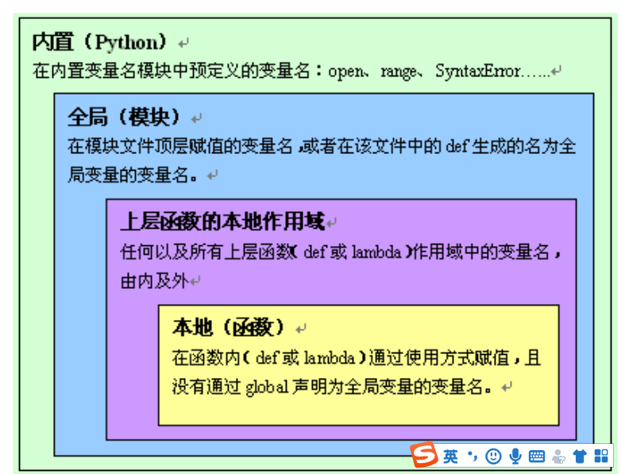

# **<font color=Red>函数参数，返回值，作用域**

## **<font color=Red>函数参数**

```python
def foo(x,y=100,*args,z=100,g,**kwargs:
       pass)

参数规则
参数列表参数一般顺序是:普通参数、缺省参数、可变位置参数、keyword-only参数(可带缺省值)、可变关键字参数。
普通参数、缺省参数 : x,y=100
可变位置参数 :


def foo(x,y=100,*,g,**kwargs:
       pass)

g:表明必须是keyword-only参数(可带缺省值),此时函数中×仅仅变量后面的变量为keyword-only变量，传参必须有关键字


```


### **<font color=Red>参数解构**
```python
'''
参数解构:#只能用在函数实参的场景
在给函数提供实参的时候,可以在可迭代对象前使用 * 或者 ** 来进行结构的解构,提取出其中所有元素作为
函数的实参
使用 * 解构成位置传参
使用 ** 解构成关键字传参
提取出来的元素数目要和参数的要求匹配
'''


def add(x, y):
  print(x, y)
  return x + y

add(*{'a':1,'b':3}.items()) # *[('a', 1), ('b', 3)]
add(4, 5)
add((4, 5)) #
t = 4, 5
add(t[0], t[1])
add(*t)
add(*(4, 5))
add(*[4, 5])
add(*{4, 5})
add(*range(4, 6))
add(*{'a':10, 'b':11}) # 可以吗?
add(**{'a':10, 'b':11}) # 可以吗?
add(**{'x':100, 'y':110}) # 可以吗?
add(**{'a':1,'b':3}.keys())
```
## **<font color=Blue>函数作用域**

　**<font color=Red>赋值即为定义一个新的变量</font>**

```python

x = 5

def foo():
    print(x)

def foo():
    #y = x + 1 # 报错吗
    x += 1 # 赋值即为重新定义　这样ｘ就会被重新定义局部变量ｘ
    # x = x + 1 等式先算右边，先算ｘ　发现ｘ没有赋值先　即使用，那么就报错
    # x = 只要有这个，立即转为本地变量
    print(x)
foo()

---------------------------------------------------------------------------
UnboundLocalError                         Traceback (most recent call last)
<ipython-input-24-ec4abcd516de> in <module>()
      8     x += 1 # 打开这一句报错吗?为什么?换成x = 1行吗
      9     print(x)
---> 10 foo()

<ipython-input-24-ec4abcd516de> in foo()
      6 def foo():
      7     #y = x + 1 # 报错吗
----> 8     x += 1 # 打开这一句报错吗?为什么?换成x = 1行吗
      9     print(x)
     10 foo()

UnboundLocalError: local variable 'x' referenced before assignment


x = 5
def foo():
    print(x)#打印不出来，使用了局部变量，但是ｘ还没有赋值，
    #UnboundLocalError: local variable 'x' referenced before assignment
    x = 200　只要有赋值语句，那么就在当前作用域内都有效，
    print(x)
print(x)　
foo()

打印结果：
5

---------------------------------------------------------------------------
UnboundLocalError                         Traceback (most recent call last)
<ipython-input-25-b76af1678554> in <module>()
      5     print(x)
      6 print(x)
----> 7 foo()

<ipython-input-25-b76af1678554> in foo()
      1 x = 5
      2 def foo():
----> 3     print(x)
      4     x = 200
      5     print(x)

UnboundLocalError: local variable 'x' referenced before assignment

x = 5
def foo():
    print(x)#打印不出来，
    x = 200　只要有赋值语句，那么就在当前作用域内都有效，
print(x)　
foo()

```

### 总结
- x+=1 这种是特殊形式产生的错误的原因?**<font color=Red>先引用后赋值,而python动态语言是赋值才算定义,才能被引
用</frnt>**。解决办法,在这条语句前增加x=0之类的赋值语句,或者使用global 告诉内部作用域,去全局作用域查找
变量定义
- 内部作用域使用 x = 10 之类的赋值语句会重新定义局部作用域使用的变量x,但是,一旦这个作用域中使用
global 声明x为全局的,那么x=5相当于在为全局作用域的变量x赋值


## **<font color=Red>闭包****

－　**<font color=Red>自由变量**:未在本地作用域中定义的变量。例如定义在内层函数外的外层函数的作用域中的变量
－　闭包:就是一个概念,出现在嵌套函数中,指的是**<font color=Red>内层函数引用到了外层函数的自由变量**,就形成了闭包。很多语
言都有这个概念,最熟悉就是JavaScript


```python

def count(c = 0):
    #c = 0
    def inc():
        nonlocal c #将变量标记为不在本地作用域定义,而是在上级的某一级局部作用域中定义,但不能是全局作用域中
定义
        c += 2
        return c
    return inc
foo = count() #counter函数并返回inc对应的函数对象,注意这个函数对象并不释放,因为有foo记着

print(foo(),foo())
c = 100
print(foo())

结果为什么是２，４，６
１　第一次调用foo()后，函数inc引用计数减一,但是函数没有消失，第二次调用foo()的时候，前面第一次的
值　还在ｃ的值为２，所以结果为４
'''
/home/joey/python/code/venv/bin/python /home/joey/python/code/t1.py
2 4
6

Process finished with exit code 0
'''
```


## **<font color=Red>缺省值**

### **<font color=Red>函数缺省值，需要注意引用类型**

```python
def bax(x=[]):
    x.append(1)
    print(x)

print(1,bax.__defaults__)
bax()
print(2,bax.__defaults__)
bax()
print(3,bax.__defaults__)

/home/joey/python/code/venv/bin/python /home/joey/python/code/t3.py
1 ([],)
[1]
2 ([1],)
[1, 1]
3 ([1, 1],)

def bax(x=[],m=123,n='123'):
    x.append(1)
    print(x)

print(1,id(bax),bax.__defaults__)
bax()
print(2,id(bax),bax.__defaults__)
bax()
print(3,id(bax),bax.__defaults__)

/home/joey/python/code/venv/bin/python /home/joey/python/code/t3.py
1 140711842311704 ([], 123, '123')
[1]
2 140711842311704 ([1], 123, '123')
[1, 1]
3 140711842311704 ([1, 1], 123, '123')　#元祖引用类型错误

Process finished with exit code 0


def bax(x,m=123,n='abc'):
    m = 456
    n = 'def'
    print(x)

print(1,id(bax),bax.__defaults__)
bax("magedu")
print(2,id(bax),bax.__defaults__)

/home/joey/python/code/venv/bin/python /home/joey/python/code/t3.py
1 139995612831256 (123, 'abc')
magedu
2 139995612831256 (123, 'abc')

Process finished with exit code 0


def bax(x,m=123,*, n='abc',t=[1,2,3]):
    m = 456
    n = 'def'
    #t.append(200)
    t = t[:]
    t.append(200)
    print(x)

print(1,id(bax),bax.__defaults__,bax.__kwdefaults__)
bax("magedu")
print(2,id(bax),bax.__defaults__,bax.__kwdefaults__)

/home/joey/python/code/venv/bin/python /home/joey/python/code/t3.py
1 140677346573848 (123,) {'n': 'abc', 't': [1, 2, 3]}
magedu
2 140677346573848 (123,) {'n': 'abc', 't': [1, 2, 3, 200]}

Process finished with exit code 0
/home/joey/python/code/venv/bin/python /home/joey/python/code/t3.py
1 140095586446872 (123,) {'n': 'abc', 't': [1, 2, 3]}
magedu
2 140095586446872 (123,) {'n': 'abc', 't': [1, 2, 3]}

Process finished with exit code 0


def x(a=[]):
    a += [5] # 　列表在+=的时候，就地修改，ａ地址不变

print(x.__defaults__)
x()
x()
print(x.__defaults__)


def y(a=[]):
    a = a + [5] #返回新的列表，那么ａ就是一个新的列表　ａ是一个新的列表和地址，跟default　a = __defaults__ + [5]
print(y.__defaults__)
y()
y()
print(y.__defaults__)


------------------------------------------
/home/joey/python/code/venv/bin/python /home/joey/python/code/t3.py
([],)
([5, 5],)
([],)
([],)

Process finished with exit code 0

'''
这就要说到列表的+和+=的区别:
+表示两个列表合并并返回一个全新的列表
+=表示,就地修改前一个列表,在其后追加后一个列表。就是extend方法
'''

```



## **<font color=Red>变量名解析原则LEGB***

- Local,本地作用域、局部作用域的local命名空间。函数调用时创建,调用结束消亡
- Enclosing,Python2.2时引入了嵌套函数,实现了闭包,这个就是嵌套函数的外部函数的命名空间
- Global,全局作用域,即一个模块的命名空间。模块被import时创建,解释器退出时消亡
- Build-in,内置模块的命名空间,生命周期从python解释器启动时创建到解释器退出时消亡。例如

print(open),print和open都是内置的变量所以一个名词的查找顺序就是LEGB


## **<font color=Red>变函数的销毁**
- 定义一个函数就是生成一个函数对象,函数名指向的就是函数对象。
- **<font color=Red>可以使用del语句删除函数,使其引用计数减1。**
- 可以使用同名标识符覆盖原有定义,本质上也是使其引用计数减1。
- Python程序结束时,所有对象销毁。
- **<font color=Red>函数也是对象,也不例外,是否销毁,还是看引用计数是否减为0**
