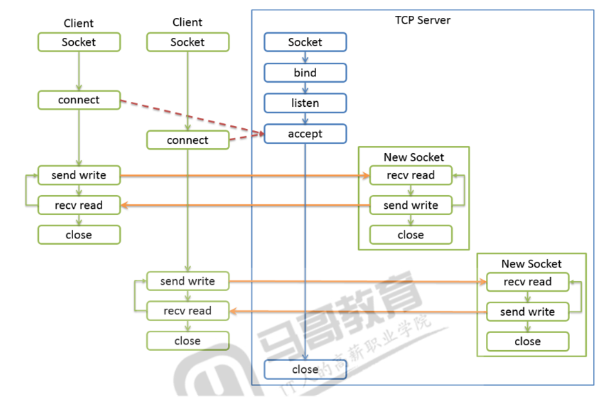

 # **<font color=Red> Socket**




```python
import socket
import time
server = socket.socket() #TCP
#print(server.__slots____)
IP = '127.0.0.1'
PORT = 9999
server.bind((IP,PORT))
server.listen()
print(server)


newsock, clinetinf = server.accept() #阻塞
print(newsock)
print('new1',clinetinf)
while True:
    data = newsock.recv(1024)# 阻塞
    print(data)
    newsock.send('server ok. data={}'.format(data).encode())
newsock.close()
print("----------------------------------------------------------------------")
newsock2, clinetinf2 = server.accept() #阻塞
print(newsock2)
print('new2',clinetinf2)
data = newsock2.recv(1024)#阻塞
print(data)
newsock2.send('server ok. data={}'.format(data).encode())
newsock2.close()


server.close()

```

```python
import socket
import time
import datetime
import threading


class CharServer:

    def __init__(self, IP='127.0.0.1', PORT=9999):
        self.socket = socket.socket()
        self.adrr = IP,PORT

    def start(self):
        self.socket.bind(self.adrr)
        self.socket.listen()
        threading.Thread(target=self.accept,name='accept').start()

    def accept(self):
        while True:
            newsock, clientinfo = self.socket.accept() #阻塞
            threading.Thread(target=self.recv,args=(newsock,clientinfo),name="recv").start()
        # while True:
        #     data = newsock.recv(1024)
        #     print(data)
        #
        #
        #     msg = '{:%Y/%m/%d %H:%M:%S} [{}:{}] -{}'.format(datetime.datetime.now(),*clientinfo,data.decode())
        #
        #     newsock.send(msg.encode())

    def recv(self,newsock,clientinfo):
        while True:
            data = newsock.recv(1024)
            print(data)


            msg = '{:%Y/%m/%d %H:%M:%S} [{}:{}] -{}'.format(datetime.datetime.now(),*clientinfo,data.decode())

            newsock.send(msg.encode())
    def stop(self):
        self.socket.close()

cs = CharServer()
cs.start()

while True:
    cmd = input(">>>>>>>>>>>>>")
    if cmd == 'quit':
        cs.stop()
        break
    else:
        print(threading.enumerate())
```

```python
import socket
import time
import datetime
import threading
import logging

FORMAT = '%(asctime)s %(process)s %(processName)s\t%(message)s'
logging.basicConfig(format=FORMAT, level=logging.INFO)


class CharServer:

    def __init__(self, IP='127.0.0.1', PORT=9999):
        self.socket = socket.socket()
        self.adrr = IP,PORT
        self.event = threading.Event()
        self.clients = {}

    def start(self):
        self.socket.bind(self.adrr)
        self.socket.listen()
        threading.Thread(target=self.accept,name='accept').start()

    def accept(self):
        while not self.event.is_set():
            newsock, clientinfo = self.socket.accept() #阻塞
            self.clients[clientinfo]=newsock
            threading.Thread(target=self.recv,args=(newsock,clientinfo),name="recv").start()

    def recv(self,newsock:socket.socket, clientinfo):
        while not self.event.is_set():
            data = newsock.recv(1024)
            if data.strip() == b'' or data == b'bye':
                self.clients.pop(clientinfo)
                newsock.close()
                break
            else:
                print(data)
                msg = '{:%Y/%m/%d %H:%M:%S} [{}:{}] -{}'.format(datetime.datetime.now(), *clientinfo, data.decode())
                for s in self.clients.values():
                    s.send(msg.encode())

    def stop(self):
        self.event.set()
        for s in self.clients.values():
            s.close()
        self.clients.clear()
        self.socket.close()

cs = CharServer()
cs.start()

while True:
    cmd = input(">>>>>>>>>>>>>")
    if cmd == 'quit':
        cs.stop()
        break
    else:
        print(threading.enumerate())
```


```python
import socket
import time
import datetime
import threading
import logging

FORMAT = '%(asctime)s %(process)s %(processName)s\t%(message)s'
logging.basicConfig(format=FORMAT, level=logging.INFO)


class CharServer:

    def __init__(self, IP='127.0.0.1', PORT=9999):
        self.socket = socket.socket()
        self.adrr = IP,PORT
        self.event = threading.Event()
        self.clients = {}
        self.lock = threading.Lock()

    def start(self):
        self.socket.bind(self.adrr)
        self.socket.listen()
        # accept会阻塞主线程,所以开一个新线程
        threading.Thread(target=self.accept,name='accept').start()

    def accept(self):
        while not self.event.is_set():
            newsock, clientinfo = self.socket.accept() #阻塞
            with self.lock:
                self.clients[clientinfo] = newsock #字典遍历时，不能改变size大小
            #准备接收数据, recv是阻塞的, 开启新的线程
            threading.Thread(target=self.recv,args=(newsock,clientinfo),name="recv").start()

    def recv(self,newsock:socket.socket, clientinfo):
        while not self.event.is_set():
            try:
                data = newsock.recv(1024)
            except:
                data=b''
            if data.strip() == b'' or data == b'bye':
                with self.lock:
                    self.clients.pop(clientinfo)
                newsock.close()
                break
            else:
                print(data)
                msg = '{:%Y/%m/%d %H:%M:%S} [{}:{}] -{}'.format(datetime.datetime.now(), *clientinfo, data.decode())
                exps = []
                expc = []
                with self.lock:
                    for c,s in self.clients.items():
                        try:
                            s.send(msg.encode()) #有可能异常
                        except:
                            exps.append(s)
                            expc.append(c)
                    for c in expc:
                        self.clients.pop(c)
                for s in exps:
                    s.close()

    def stop(self):
        self.event.set()
        keys = []
        with self.lock:
            keys = list(self.clients.keys())
            self.clients.clear()
        for s in keys:
            s.close()
        self.socket.close()

cs = CharServer()
cs.start()

while True:
    cmd = input(">>>>>>>>>>>>>").strip()
    if cmd == 'quit':
        print(cmd)
        cs.stop()
        print(cmd)
        threading.Event().wait(3)
        break
    else:
        print(threading.enumerate())

logging.info(threading.enumerate()) # 用来观察断开后线程的变化
logging.info(cs.clients)
```
